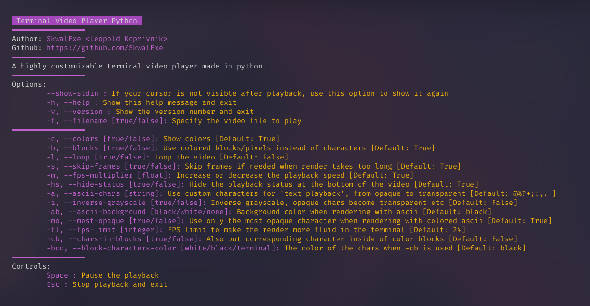
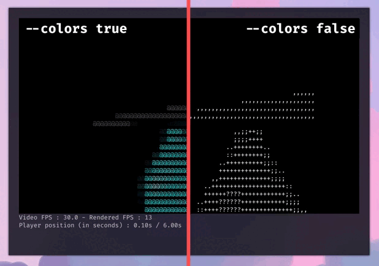
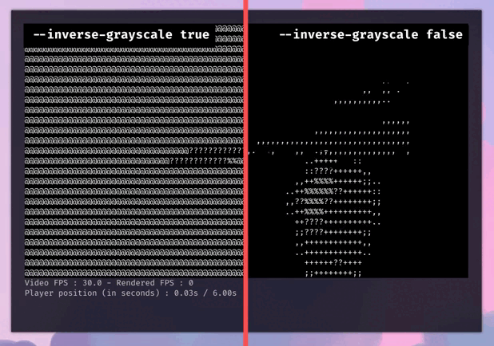
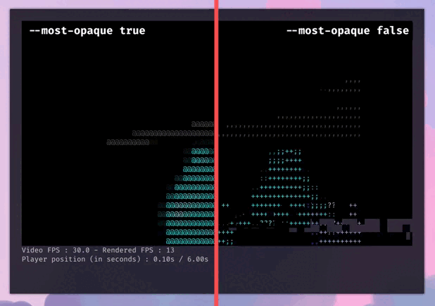
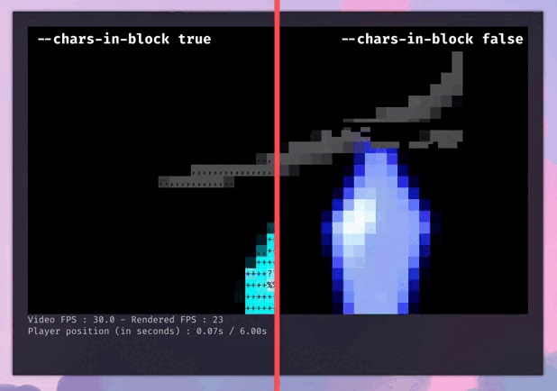

# Python Terminal Video Player

🎥 Highly customizable terminal video player written in Python using [OpenCV](https://opencv.org/).


# How to use

First, clone the repository:

```bash
git clone https://github.com/SkwalExe/terminal-video-player-python
```

Then, install the dependencies:

```bash
pip3 install -r requirements.txt
```

Now, you can try the program with the example video provided with the repository:

```bash
python3 src/main.py -f bad-apple-colored.mp4
```

# Options



The option list below is not exhaustive. For a complete list of options, see the image above, or run `python3 main.py --help`.

### The -c/--colors option

If true, the video will be played in color, else it will be played in grayscale.



### The -i/--inverse-grayscale option

Inverse the opacity of the characters.



### The -mo/--most-opaque option

If true, use the most opaque character when rendering with colored ascii.



### The -cb/--chars-in-blocks option

Also put corresponding characters in colored blocks when the --blocks option is true.

